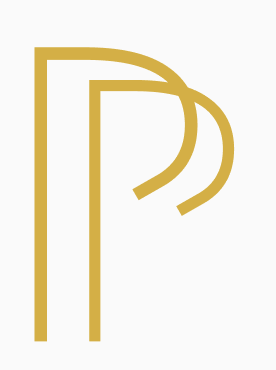

# Premium Properties

**Author:** Jarryd Carelse  
**Contact:** +27 71 480 8011 | 221267@virtualwindow.co.za  
**Project Type:** University Assignment  
**Course:** Advanced PHP Concepts and Authentication  
**Year:** Second-Year Development Student



---

## Project Overview

**Premium Properties** is a sophisticated web application developed to simulate the functionalities of a real estate agency's online platform. This project was undertaken as part of a university assignment to demonstrate advanced skills in PHP, SQL, and full-stack web development. The application supports property management, user interactions, and administrative content moderation, all through an intuitive and secure interface.

This project is designed to highlight key competencies such as user authentication, CRUD (Create, Read, Update, Delete) operations, and the implementation of role-based access control, providing a solid foundation for developing complex, real-world web applications.

## Features

### User Functionality

- **Registration & Authentication:**
  - **User Registration:** New users can create an account using a secure registration form, ensuring their data is safely stored in the database.
  - **User Login:** Existing users can log in to the platform using their credentials, gaining access to personalized features and services.

- **Property Management:**
  - **Add Property Listings:** Users can submit new property listings, including detailed descriptions, images, and pricing information. These properties can be managed directly through the user's profile.
  - **Liked Properties:** Users can save properties of interest to a dedicated "Liked" page, allowing for easy access and review of their favorite listings.

- **Search & Filter:**
  - **Property Search:** Users can utilize the search bar to find specific properties based on keywords.
  - **Advanced Filtering:** Users can refine their search results using various filters such as location, price range, property type, and more.

- **User Interaction:**
  - **View Property Details:** Users can access detailed information about each property, including images, descriptions, and pricing.
  - **Commenting & Liking:** Users can engage with property listings by leaving comments and liking properties, fostering a community-driven platform.
  - **User Activity Tracking:** All user activities, including comments and likes, are tracked and can be reviewed by the user within their profile.

### Admin Functionality

- **Admin Dashboard:**
  - **Centralized Management:** Admins have access to a dedicated dashboard that provides an overview of the platform’s content, user activities, and property listings.
  - **Role-Based Access Control:** Admins can manage platform users, property listings, and comments with elevated privileges.

- **Property Approval:**
  - **Moderation of Listings:** Admins can review and approve or deny property listings submitted by users. This ensures that only appropriate and verified content is displayed on the platform.
  
- **User & Comment Management:**
  - **User Management:** Admins can manage user accounts, including the ability to suspend or delete accounts as necessary.
  - **Comment Moderation:** Admins can monitor and moderate user comments, removing any content that violates platform guidelines.

## Technical Details

### Technologies Used

- **Frontend Development:**
  - **HTML/CSS:** Structured and styled the web pages to create a responsive and visually appealing user interface.
  - **JavaScript:** Enhanced interactivity and user experience through dynamic content and client-side validation.
  - **Figma:** Utilized for UI/UX design, enabling the creation of wireframes, mockups, and prototypes that guided the development process.

- **Backend Development:**
  - **PHP:** Served as the core language for server-side logic, managing user sessions, form submissions, and data processing.
  - **SQL/MySQL:** Employed for database management, facilitating the storage, retrieval, and manipulation of user data, property listings, and comments.

- **Development Environment:**
  - **XAMPP:** Used as the local development environment, providing Apache, MySQL, and PHP servers to test and run the application.
  - **VS Code:** The primary integrated development environment (IDE) used for writing, debugging, and maintaining the codebase.

### Database Structure

The application employs a relational database designed to efficiently manage user information, property listings, and interactions. The key tables include:

- **Users Table:**
  - **Schema:** Stores user credentials, roles (e.g., admin, regular user), and personal details.
  - **Security:** Passwords are securely hashed to protect user data.

- **Properties Table:**
  - **Schema:** Contains all property details, including unique property IDs, titles, descriptions, prices, locations, and the user IDs of the property owners.

- **Comments Table:**
  - **Schema:** Manages user-generated comments on properties, linking each comment to a specific user and property.

- **Likes Table:**
  - **Schema:** Tracks user interactions with properties, such as likes, allowing for personalized recommendations.

## Installation & Setup

To set up and run the Premium Properties web application on your local machine, follow the steps outlined below:

### 1. Clone the Repository
Begin by cloning the project repository from GitHub to your local machine:

```bash
git clone https://github.com/yourusername/premium-properties.git

2. Set Up XAMPP
Configure XAMPP to run the application:

Move Project to XAMPP: Copy the cloned project folder into the htdocs directory of your XAMPP installation.
Start Services: Launch the XAMPP Control Panel and start the Apache and MySQL services.
3. Database Setup
Set up the database for the application:

Access phpMyAdmin: Open your web browser and navigate to http://localhost/phpmyadmin.
Create Database: Create a new database named premium_properties.
Import Database: Import the database.sql file located in the project’s root directory into the newly created database.
4. Configure the Application
Configure the application to connect to your local database:

Edit Configuration File: Open the config.php file located in the /config directory.
Update Database Credentials: Enter your MySQL credentials (DB_HOST, DB_USER, DB_PASS, and DB_NAME) to establish a connection with the database.
5. Run the Application
Once everything is set up, you can access the application:

Access the Application: In your web browser, navigate to http://localhost/premium-properties to begin using the web application.


